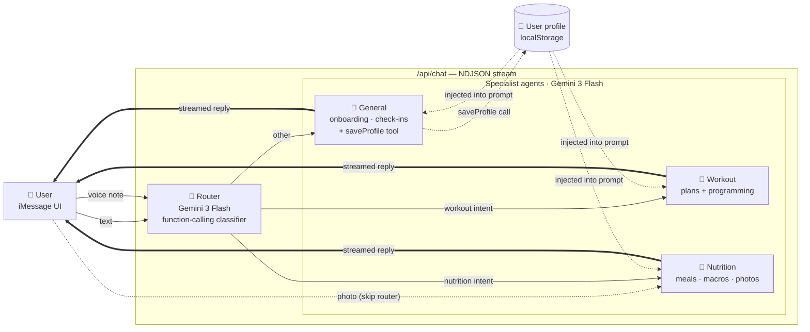

# Kai

A small AI health coach that lives inside an iMessage interface. Text it, send a voice note, or upload a photo of your meal — it'll plan workouts, estimate macros, and keep tabs on you.

## Architecture



A lightweight router classifies each message and hands it off to one of three specialist agents. The user only ever sees a single coach (Kai) — the routing is invisible. Profile context is built up over time and injected into every prompt.

## Run

```bash
npm install
cp .env.example .env.local   # add GEMINI_API_KEY
npm run dev
```

## Stack

Next.js 16 · TypeScript · Tailwind v4 · `@google/genai` (Gemini 3 Flash) · Zustand · MediaRecorder API
