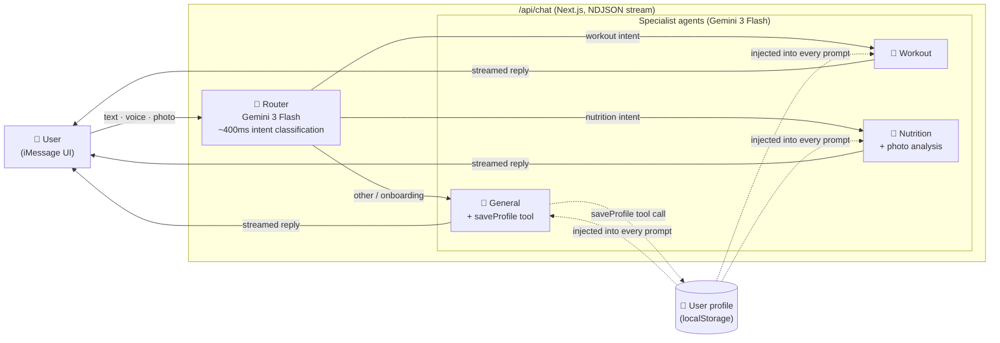

# Kai — A 2-hour iMessage AI health coach

A working web demo of **Kai, an AI health coach you can text like a friend**.

A pixel-faithful iMessage UI on the outside. A multi-agent Gemini orchestration on the inside. The user only ever sees one personality ("Kai"); under the hood, three specialist agents are quietly routed to by an intent classifier.

---

## How it works (in 5 simple steps)

1. **You type, talk, or upload a food photo.** Anything goes into the same iMessage input.
2. **The browser POSTs the message + your profile + any attachment** to `/api/chat` as one streaming request.
3. **A tiny router (Gemini 3 Flash)** reads the last few turns and classifies the intent in ~400ms: `workout` · `nutrition` · `general`. Photos skip the router and go straight to nutrition.
4. **The right specialist agent (Gemini 3 Flash)** generates the reply. Each agent shares the same `Kai` persona but adds a small "role this turn" addendum (workout designer / nutrition coach / onboarding companion). The general agent can also call a `saveProfile` tool to remember things you tell it (name, goal, equipment, etc.).
5. **The reply streams back as NDJSON** — one chunk per token group — and the iMessage bubble fills in live, just like a real text conversation.

The user **never** sees agent names, route badges, or "thinking" indicators beyond the iMessage typing dots. Routing is invisible by design.

---

## Architecture




### Why this design

- **One persona, many brains.** A central `lib/persona.ts` defines Kai's voice (lowercase, opinionated, asks one question at a time, narrates actions). Every agent inherits it, so the chat *feels* like one coach.
- **Speed first.** Everything runs on Gemini 3 Flash — sub-second classification + streaming generation, so the chat feels conversational, not API-call-heavy.
- **Multimodal in one shot.** Voice notes and food photos are sent inline as base64 in the same request. Gemini handles audio transcription + image understanding natively, so no separate Whisper or OCR step.
- **Personalized from turn one.** The user profile (built incrementally during onboarding) is injected as a system-prompt block on every call, so every reply already knows who you are.

---

## Stack

- **Next.js 16** (App Router) + TypeScript + **Tailwind CSS v4**
- **`@google/genai`** SDK — Gemini 3 Flash (preview) for both router and agents, with automatic fallback if a request fails
- **Zustand** with `localStorage` persistence — chat state + user profile
- **MediaRecorder API** for voice notes; `<input type="file">` for photo uploads

```
app/
  api/chat/route.ts       — orchestrator: NDJSON stream, calls router then agent
  page.tsx                — iPhone shell + chat loop
components/
  IPhoneFrame.tsx         — iPhone 15 Pro mockup
  BrandShell.tsx          — landing-page wrapper (left brand · phone · right presets)
  ChatHeader.tsx          — iOS status bar + Kai contact strip
  ChatBubble.tsx          — iMessage bubble + SVG tail + typing indicator
  InputBar.tsx            — text + photo upload + mic recorder
lib/
  persona.ts              — base voice rules + onboarding guidance
  store.ts                — Zustand state with localStorage middleware
  chatClient.ts           — NDJSON streaming reader
  agents/
    config.ts             — central model config + env overrides
    router.ts             — Gemini 3 Flash, function-calling classifier
    general.ts            — Gemini 3 Flash + saveProfile tool (handles onboarding)
    workout.ts            — Gemini 3 Flash, workout designer
    nutrition.ts          — Gemini 3 Flash, meal planner / logger / photo analyzer
```

---

## Run locally

```bash
npm install
cp .env.example .env.local
# add your GEMINI_API_KEY to .env.local
npm run dev
```

Open [http://localhost:3000](http://localhost:3000) and start chatting.

Try the preset bubbles on the right side, or:

- *"design me a 35-min dumbbell workout"* → routes to **workout**
- *"I had eggs, toast, and coffee for breakfast"* → routes to **nutrition**
- *"I'm feeling demotivated today"* → routes to **general**
- Tap `**+`** to upload a food photo → goes straight to **nutrition** for calorie + macro analysis
- Tap the **mic** to send a voice note

Reset any time via the **reset demo** button (bottom right).

### Model overrides

Everything defaults to `gemini-3-flash-preview`. You can override any of the three via `.env.local`:

```
GEMINI_AGENT_MODEL=gemini-3-flash-preview
GEMINI_FALLBACK_MODEL=gemini-3-flash-preview
GEMINI_ROUTER_MODEL=gemini-3-flash-preview
```

---

## Deploy

Push to GitHub, then deploy on [Vercel](https://vercel.com/new). Add `GEMINI_API_KEY` as an env var in the Vercel project settings.

---

## Built by

[Margi Shah](https://github.com/margishah) — software engineer building thoughtful product UIs.